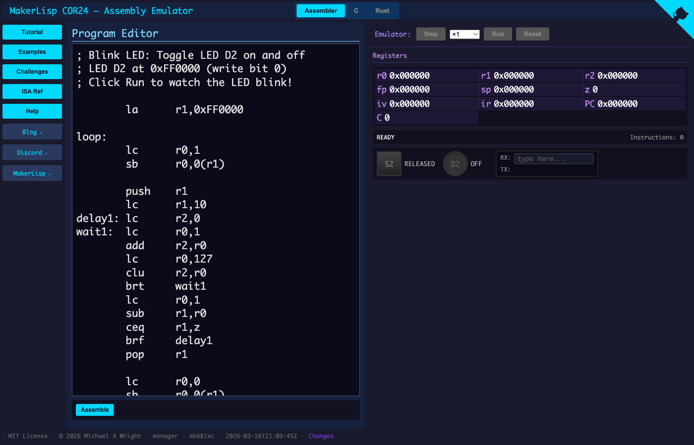
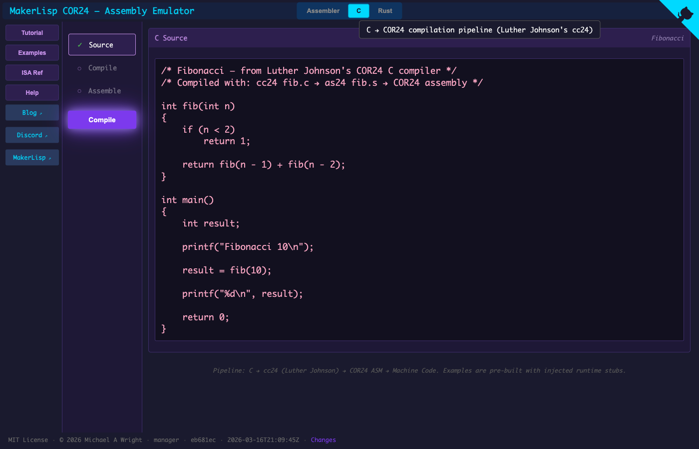
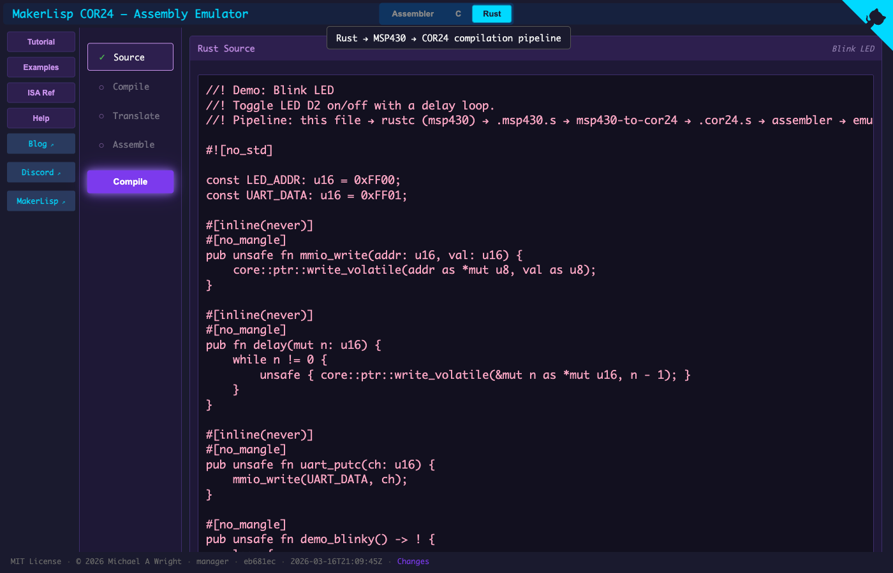

# MakerLisp COR24 — Assembly Emulator

A browser-based educational emulator for the
[MakerLisp](https://makerlisp.com) COR24 (C-Oriented RISC, 24-bit)
architecture. Written in Rust and compiled to WebAssembly.

**[Live Demo](https://sw-embed.github.io/cor24-rs/)**

### Assembler Tab


### C Tab


### Rust Tab


## Features

- **Interactive Assembly Editor** — Write and edit COR24 assembly code
- **Step-by-Step Execution** — Debug your code instruction by instruction
- **Multi-Region Memory Viewer** — Program, Stack, and I/O regions with change heatmaps
- **CLI Debugger** (`cor24-dbg`) — GDB-like command-line debugger with breakpoints, UART, and LED/button I/O
- **LGO File Loader** — Load programs assembled with the reference `as24` toolchain
- **Built-in Examples** — Learn from pre-loaded example programs
- **Challenges** — Test your assembly skills with programming challenges
- **ISA Reference** — Instruction set documentation and memory map

## COR24 Architecture

COR24 is a 24-bit RISC soft CPU for Lattice MachXO FPGAs, designed for
embedded systems education. 32 operations encode into 211 instruction
forms (1, 2, or 4 bytes).

- **3 General-Purpose Registers**: r0, r1, r2 (24-bit)
- **5 Special-Purpose Registers**:
  - r3 = fp (frame pointer)
  - r4 = sp (stack pointer, init 0xFEEC00)
  - r5 = z (always zero; usable only in compare instructions)
  - r6 = iv (interrupt vector)
  - r7 = ir (interrupt return address)
- **Single Condition Flag**: C (set by compare instructions)
- **16 MB Address Space**: 1 MB SRAM + 3 KB EBR (stack) + memory-mapped I/O
- **Variable-Length Instructions**: 1, 2, or 4 bytes

### Supported Instructions

| Category | Instructions |
|----------|-------------|
| Arithmetic | `add`, `sub`, `mul` |
| Logic | `and`, `or`, `xor` |
| Shifts | `shl`, `sra`, `srl` |
| Compare | `ceq`, `cls`, `clu` |
| Branch | `bra`, `brf`, `brt` |
| Jump | `jmp`, `jal` |
| Load | `la`, `lc`, `lcu`, `lb`, `lbu`, `lw` |
| Store | `sb`, `sw` |
| Stack | `push`, `pop` |
| Move | `mov`, `sxt`, `zxt` |

## Examples & Demos

This project has two sets of examples, matching the two tabs in the web UI:

- **[Assembler Examples](docs/assembler-examples.md)** — 11 hand-written COR24 assembly programs.
  Available in the web UI's **Assembler** tab (click Examples → pick one → Assemble → Run)
  and via `cor24-dbg` on the command line (see `scripts/demo-cli-*.sh`).

- **[Rust Pipeline Demos](docs/rust-pipeline-demos.md)** — 12 Rust programs compiled through the
  Rust → MSP430 → COR24 cross-compilation pipeline.
  Available in the web UI's **Rust** tab (pick example → Compile → Translate → Assemble → Run)
  and via CLI scripts in `rust-to-cor24/demos/` (see `run-demo.sh`, per-demo `run.sh`, `generate-all.sh`).

```bash
# Assembler example via CLI debugger
scripts/demo-cli-hello-world.sh

# Rust pipeline demo via CLI
rust-to-cor24/demos/run-demo.sh demo_add
rust-to-cor24/demos/run-demo.sh demo_echo_v2 --uart-input 'hello!'
```

For an overview of all the binaries and how they fit together, see **[docs/eli5.md](docs/eli5.md)**.

## Building

### Prerequisites

- [Rust](https://rustup.rs/) (1.75+)
- [Trunk](https://trunkrs.dev/) (`cargo install trunk`)
- wasm32-unknown-unknown target (`rustup target add wasm32-unknown-unknown`)

### Development

```bash
# Serve locally with hot reload (port 7401)
./serve.sh

# Or directly:
trunk serve --port 7401

# Open http://localhost:7401/cor24-rs/
```

### Production Build

```bash
# Build optimized WASM to pages/
trunk build --release
```

## Project Structure

```
cor24-rs/
├── src/
│   ├── cpu/           # CPU emulator core
│   │   ├── decode_rom.rs  # Instruction decode ROM (from hardware)
│   │   ├── encode.rs      # Instruction encoding tables
│   │   ├── executor.rs    # Instruction execution engine
│   │   ├── instruction.rs # Opcode definitions
│   │   └── state.rs       # CPU state (registers, memory regions, I/O)
│   ├── emulator.rs    # EmulatorCore — shared controller for CLI and Web
│   ├── assembler.rs   # Two-pass assembler
│   ├── loader.rs      # LGO file loader (as24 output format)
│   ├── challenge.rs   # Challenge definitions
│   ├── wasm.rs        # WASM bindings (WasmCpu wraps EmulatorCore)
│   └── app.rs         # Yew web application
├── cli/               # CLI debugger (cor24-dbg)
├── components/        # Reusable Yew UI components
├── tests/programs/    # Assembly test programs (.s files)
├── scripts/           # Demo and build scripts
├── styles/            # CSS stylesheets
└── pages/             # Built WASM output (GitHub Pages)
```

## Testing

```bash
cargo test
```

## License

MIT License - see [LICENSE](LICENSE)

## Acknowledgments

- COR24 architecture by [MakerLisp](https://makerlisp.com) — designed for embedded systems education on Lattice MachXO FPGAs
- Decode ROM extracted from original hardware Verilog
- Reference assembler/linker (`as24`/`longlgo`) by Luther Johnson

## References

- [MakerLisp - COR24 Homepage](https://www.makerlisp.com/)
- [COR24 Soft CPU for FPGA](https://www.makerlisp.com/cor24-soft-cpu-for-fpga)
- [COR24 Test Board](https://www.makerlisp.com/cor24-test-board)
