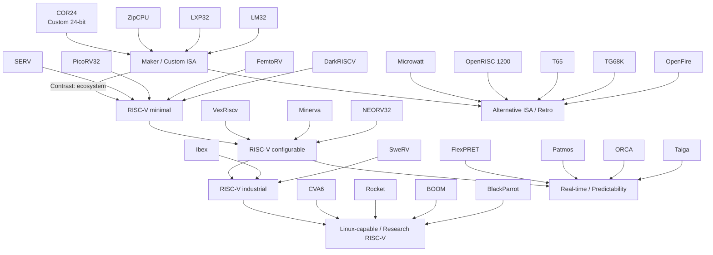

# Soft-CPU Universe Map (FPGA)

This document maps public FPGA soft CPU projects into a few **architectural families** and shows how COR24 sits in the landscape.

## 1) The Big Families

### Maker / custom ISA CPUs
These are great when you want **readable RTL** and **architecture hacking** more than ecosystem compatibility.

- COR24
- ZipCPU
- LXP32
- LM32

### RISC-V minimal cores
These trade features for **simplicity/area**, while keeping the benefit of the RISC‑V ecosystem.

- SERV (extreme area)
- PicoRV32 (popular compact)
- FemtoRV (teaching)
- DarkRISCV (hackable)

### RISC-V configurable / scalable cores
These scale from embedded to more featureful SoCs.

- VexRiscv (highly configurable)
- Minerva (Amaranth-based)
- NEORV32 (MCU-like SoC)

### RISC-V industrial / production-leaning
Verification and robustness are central.

- Ibex
- SweRV

### Linux-capable / research-scale RISC-V
Used in academic and advanced SoC work.

- CVA6
- Rocket Chip
- BOOM
- BlackParrot

### Alternative ISAs & classic recreations
Useful for comparing non‑RISC‑V ISA philosophies and retro toolchains.

- Microwatt (Power ISA)
- OpenRISC 1200 (OpenRISC)
- T65 (6502)
- TG68K (68000)
- OpenFire (MicroBlaze-compatible)

### Real-time / predictability research
If you care about worst‑case timing behavior more than peak IPC.

- FlexPRET
- Patmos
- ORCA
- Taiga

## 2) A “Complexity Ladder” (Typical progression)

SERV → PicoRV32 → VexRiscv/NEORV32 → CVA6/Rocket → BOOM/BlackParrot

## 3) Mermaid Map

## 4) How to extend this map

Add columns to the dataset for:
- HDL (Verilog/VHDL/SystemVerilog/Chisel/SpinalHDL/Amaranth)
- Bus (Wishbone/AXI/Avalon/custom)
- Cache/MMU/FPU availability
- Formal verification status
- “Runs Linux?” and “Runs Zephyr/RTOS?”
- Example FPGA boards where it has been demonstrated

Then the map can evolve from a taxonomy into an actual comparative study.
